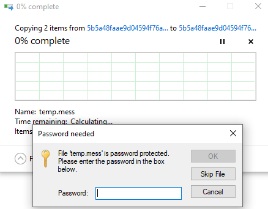
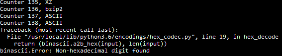
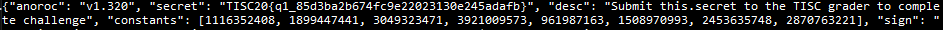

# Stage 1 Write-Up

Immediately we go ahead and try to unzip the given file. It's password protected!



To solve this, it's just looking at the information given:

- Simple password (6 characters, hex)
- Several (alot) of layers of encoding / compression

Given the simple password, I used a brute force attack on 6 character hex values, with only 16^6 possible combinations.
At first, I tried to count up from 0, but it seemed to take forever, so I tried counting down from `ffffff`.

Evetually there was an output:

``` bash
$ ./bruteforce.py
Password found:b1aa40
```

Trying to use `cat` on the file leads to a jumbled mess. 

```bash
$ cat temp.mess
BZh91AY&SYun ܹVyo[[ޯc{뽞_}ｽuگy}V.{]y;M{o{ow}T>ݝ};nݎ7Ynu8O}}wﯾ[{]޽'wۋCwn=Xz/Iݾt
cat: write error: Input/output error
```

So we can use `file` on it first to find its type, `bzip2 compressed data`. 

```bash
$ file temp.mess
temp.mess: bzip2 compressed data, block size = 900k
```


Python's own `bz2` library is easily used here.
Continuing the `file` technique, we can find `zlib`, then `XZ`, then `ASCII` (which looked like `base64` encoding),
then `ASCII` (with only `hex` values), as well as `gzip`. 
Easily found on Google, these can be decompressed/decoded with the Python libraries.
However, it seemed to go on forever, and I tried multiple times to do it manually (`test.py`) but realised this had to have 
a smarter solution - apparently multiple layers meant *a lot* of layers. 
To automate the process, there was more Googling to get shell commands done from within the Python script,
as well as learning about how to use `awk`. 
The script was eventually done, there was a bit of minor troubleshooting, and finally, an error came up!

```bash
$ ./decode.py
```



``` Python
Traceback (most recent call last):
  File "/usr/local/lib/python3.6/encodings/hex_codec.py", line 19, in hex_decode
    return (binascii.a2b_hex(input), len(input))
binascii.Error: Non-hexadecimal digit found
```

It was finished, and there it was when using `cat`!

```bash
$ cat temp.mess
{"anoroc": "v1.320", "secret": "TISC20{q1_85d3ba2b674fc9e22023130e245adafb}", "desc": "Submit this.secret to the TISC grader to complete challenge", "constants": [1116352408, 1899447441, 3049323471, 3921009573, 961987163, 1508970993, 2453635748, 2870763221], "sign": "
```



Flag is easily seen:
```
TISC20{q1_85d3ba2b674fc9e22023130e245adafb}
```
